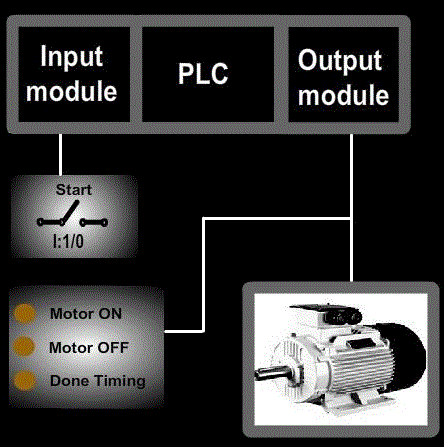
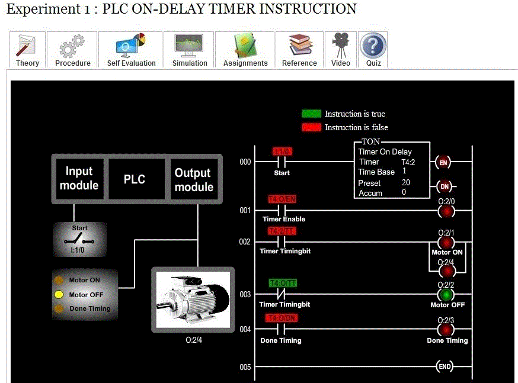
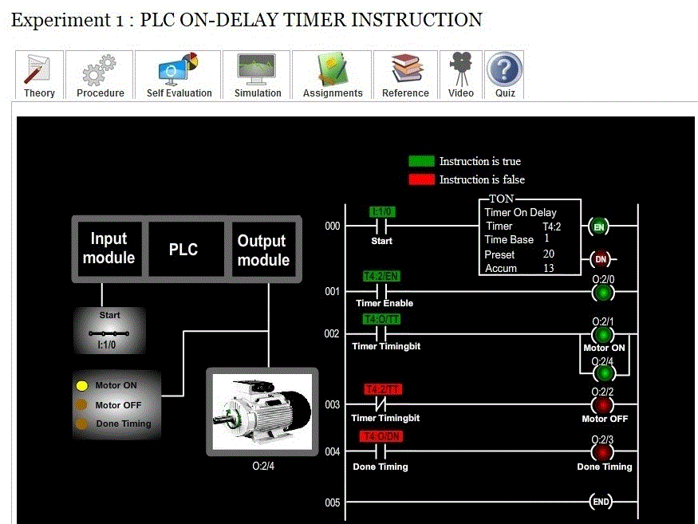
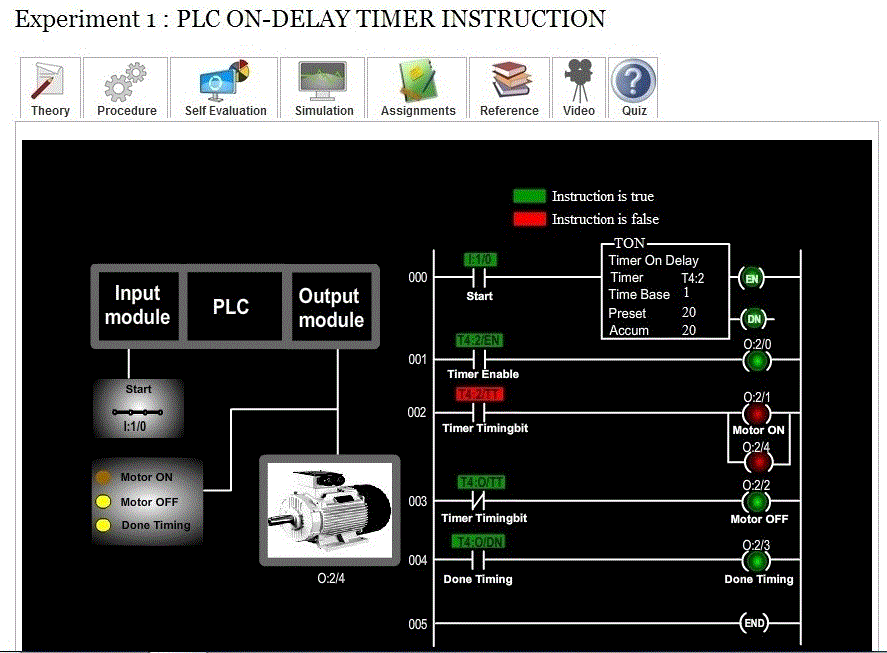

### Aim of the experiment: PLC On-Delay Timer Instruction

<strong>Aim</strong>: To understand the working of on-delay timer instruction in a programmable logic controller.

<strong>Procedure</strong>: In our experiment we wish to demonstrate the working of on-delay timer instruction.

 

<ul type="disc" style="text-align: justify;">
<li>Since inputs and outputs are less, 8-point input module and 8-point output module is sufficient, where CPU resides in slot 0, input module resides in slot 1 and output module in slot 2. </li>

<li>In our experiment, we want our motor to run for 20 seconds and for this purpose, timer on-delay instruction is used. Here, one switch is used to turn the motor ON or OFF. The working status of the motor is displayed using LED’s. when the motor is running ,
Motor ON LED will glow. When the motor is not running , Motor OFF LED will glow. When the motor has done timing , Done timing LED will glow. </li>

<li>Let us assign address for the input and output signals of the PLC:  
&nbsp;&#10147; Start (switch) : I:1/0  
&nbsp;&#10147; Motor ON (LED) : O:2/1  
&nbsp;&#10147; Motor OFF (LED) : O:2/2  
&nbsp;&#10147; Done timing (LED) : O:2/3  
&nbsp;&#10147; Motor : O:2/4 </li>

<li>Let us see the ladder diagram:

</li>

<li>In order to see how the on-delay timer instruction in a PLC works, click (toggle) the start switch and observe the timer instruction. Also, observe the LED and motor correspondingly.  
The following screen shot explains the operations: 

 
The above screen shot represents the default condition, i.e. when the switch is open.</li> 

<li> 

 
The above screen shot represents the condition when the switch is closed and timer is timing.
</li> 

<li> 

 
The above screen shot represents the condition when the timer is done timing.</li>
</ul>
